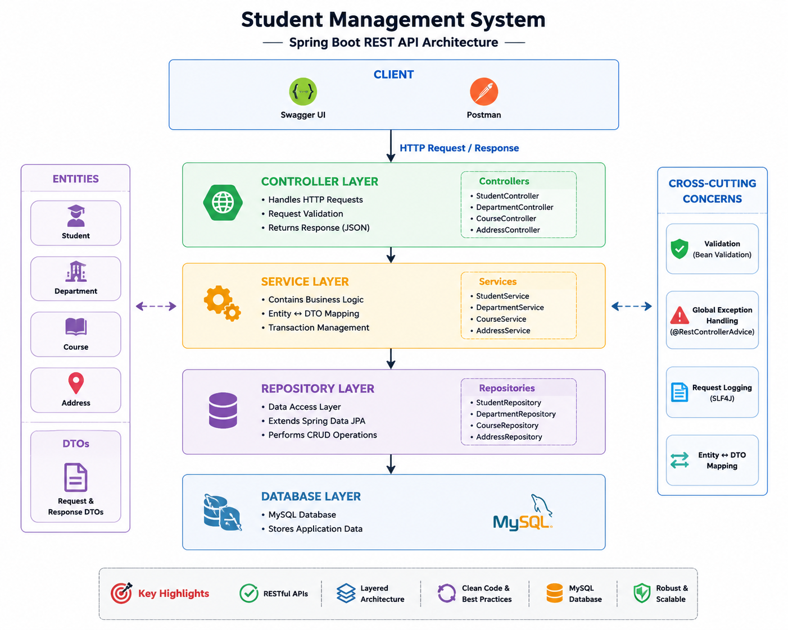
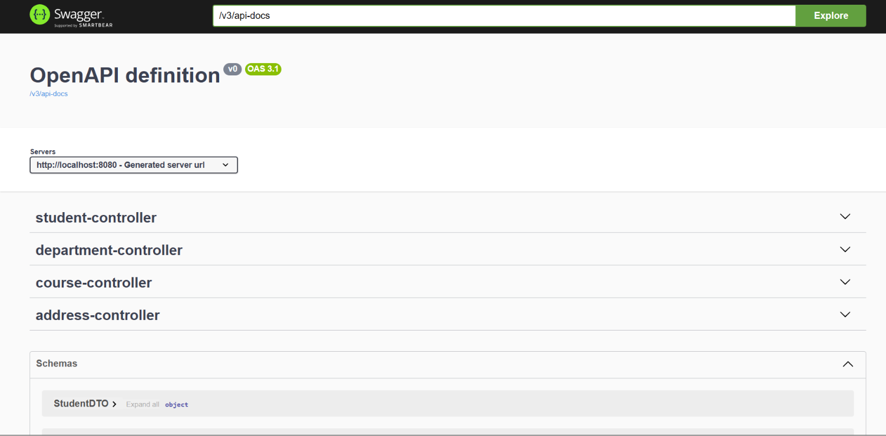

# Student Management System | Spring Boot REST API


A backend REST API built using **Spring Boot, Spring Data JPA, Hibernate, and MySQL** for managing **Students, Departments, Courses, and Addresses**.

The application follows a **layered architecture** and demonstrates modern backend development practices including **DTO Mapping, Bean Validation, Global Exception Handling, Request Logging, and Swagger API Documentation**.

---

## ✨ Features

- 👨‍🎓 Student Management
- 🏢 Department Management
- 📚 Course Management
- 📍 Address Management
- 🔄 Complete CRUD Operations
- 📦 RESTful API Design
- 🗂 DTO Pattern
- 🔁 Entity ↔ DTO Mapping
- ✅ Bean Validation
- ⚠️ Global Exception Handling
- 📝 Request Logging using SLF4J
- 🗄 MySQL Database Integration
- 🛠 Spring Data JPA & Hibernate
- 📖 Interactive Swagger API Documentation
- 🔐 API-key authentication for write operations
- 🧪 Unit and controller tests with JUnit 5 & Mockito
- 🛡️ Database-level email uniqueness and structured validation/error responses
- 💤 Explicit LAZY JPA relationships to reduce unnecessary relationship loading
- 🚦 Correct `204 No Content` responses for DELETE operations
- 🚀 Railway deployment-ready configuration
- 🏗 Layered Architecture (Controller → Service → Repository)

---

## 🛠 Tech Stack

### Backend

- Java 24
- Spring Boot
- Spring Data JPA
- Hibernate
- Spring Security

### Database

- MySQL

### API Documentation & Testing

- Springdoc OpenAPI (Swagger UI)
- Postman

### Build Tool

- Maven

### IDE

- IntelliJ IDEA Community Edition

### Version Control

- Git
- GitHub

---

## 🏗 Architecture

The application follows a **layered architecture** based on the MVC design pattern. Each layer has a single responsibility, making the codebase modular, maintainable, and easy to extend.

```text
                Client (Postman / Swagger UI)
                           │
                           ▼
                    Security Filter
                  (API Key for writes)
                           │
                           ▼
                  REST Controller Layer
                           │
                           ▼
                     Service Layer
                  (Business Logic)
                           │
                           ▼
                  Repository Layer
               (Spring Data JPA)
                           │
                           ▼
                     MySQL Database
```

### Layer Responsibilities

| Layer | Responsibility |
|--------|----------------|
| **Controller** | Handles HTTP requests and responses |
| **Service** | Implements business logic |
| **Repository** | Performs database operations using Spring Data JPA |
| **Entity** | Represents database tables |
| **DTO** | Transfers data between client and server |
| **Mapper** | Converts Entity ↔ DTO |
| **Exception** | Provides centralized exception handling |

### Architecture Diagram



---

## 📁 Project Structure

```text
src
├── main
│   ├── java
│   │   └── com.namanrai.sms
│   │       ├── controller
│   │       ├── dto
│   │       ├── entity
│   │       ├── exception
│   │       ├── repository
│   │       ├── service
│   │       ├── util
│   │       └── StudentManagementRestApiApplication.java
│   │
│   └── resources
│       └── application.properties
│
└── test
    └── java

docs
├── architecture-diagram.png
└── swagger-ui.png

```

---

## 🚀 REST API Endpoints

### 👨‍🎓 Student APIs

| Method | Endpoint | Description |
|--------|----------|-------------|
| POST | `/students` | Create a new student |
| GET | `/students` | Retrieve all students |
| GET | `/students/{id}` | Retrieve a student by ID |
| PUT | `/students/{id}` | Update an existing student |
| DELETE | `/students/{id}` | Delete a student |

---

### 🏢 Department APIs

| Method | Endpoint | Description |
|--------|----------|-------------|
| POST | `/departments` | Create a new department |
| GET | `/departments` | Retrieve all departments |
| GET | `/departments/{id}` | Retrieve a department by ID |
| PUT | `/departments/{id}` | Update an existing department |
| DELETE | `/departments/{id}` | Delete a department |

---

### 📚 Course APIs

| Method | Endpoint | Description |
|--------|----------|-------------|
| POST | `/courses` | Create a new course |
| GET | `/courses` | Retrieve all courses |
| GET | `/courses/{id}` | Retrieve a course by ID |
| PUT | `/courses/{id}` | Update an existing course |
| DELETE | `/courses/{id}` | Delete a course |

---

### 📍 Address APIs

| Method | Endpoint | Description |
|--------|----------|-------------|
| POST | `/addresses` | Create a new address |
| GET | `/addresses` | Retrieve all addresses |
| GET | `/addresses/{id}` | Retrieve an address by ID |
| PUT | `/addresses/{id}` | Update an existing address |
| DELETE | `/addresses/{id}` | Delete an address |

## 🔐 API Security

The API uses a stateless API-key security layer for write operations.

- `GET` endpoints remain publicly readable.
- `POST`, `PUT`, and `DELETE` endpoints require an `X-API-KEY` request header.
- Swagger UI and OpenAPI documentation remain accessible.
- The API key is loaded from the `API_KEY` environment variable and is never committed to Git.

Example:

```http
X-API-KEY: your-local-api-key
```

This provides a lightweight authentication boundary while keeping the project simple enough for a REST API demonstration.

## 🚀 Getting Started

Follow these steps to set up and run the project on your local machine.

---

### 📋 Prerequisites

Make sure the following software is installed before running the project:

- Java 24 (JDK)
- Maven Wrapper
- MySQL Server
- Git
- IntelliJ IDEA (recommended)

---

### 📥 Clone the Repository

```bash
git clone https://github.com/Naman-rai2005/student-management-rest-api.git
```

---

### 📂 Navigate to the Project Directory

```bash
cd student-management-rest-api
```

---

## ⚙️ Database Configuration

Create a MySQL database named:

```sql
CREATE DATABASE studentdb;
```

Configure your MySQL credentials in the `application.properties` file.

```properties
spring.datasource.url=${DB_URL:jdbc:mysql://localhost:3306/studentdb}
spring.datasource.username=${DB_USERNAME:root}
spring.datasource.password=${DB_PASSWORD}

spring.jpa.hibernate.ddl-auto=update
spring.jpa.show-sql=true

server.port=${PORT:8080}

app.security.api-key=${API_KEY}
```

> **Security Note**
>
> Set `DB_PASSWORD` to your local MySQL password and `API_KEY` to a private API key before running the application.
>
> `DB_URL`, `DB_USERNAME`, and `PORT` can also be overridden through environment variables for deployment.
>
> Never commit database credentials or API keys to GitHub.

---

## ▶️ Running the Application

Using the Maven Wrapper:

```bash
./mvnw spring-boot:run
```

Or, if Maven is installed globally:

```bash
mvn spring-boot:run
```

The application starts on:

```
http://localhost:8080
```
Windows PowerShell:

```
.\mvnw.cmd spring-boot:run
```

---

## 📖 API Documentation (Swagger UI)

Once the application is running, open the following URL in your browser:

```
http://localhost:8080/swagger-ui/index.html
```

Swagger UI provides an interactive interface for exploring and testing all available REST API endpoints without requiring Postman.



---

## 📝 Logging

The application uses **SLF4J with Lombok's `@Slf4j`** for request logging.

Logging has been implemented across the Controller and Service layers to improve debugging and trace API execution.

Example log output:

```text
INFO  POST request received to create student
INFO  Creating student with email: john@example.com
INFO  Student created successfully with id: 1
```

---

## ✅ Request Validation

The project uses **Jakarta Bean Validation** to validate incoming request data.

Examples include:

- Required fields
- Email format validation
- Minimum and maximum values
- Invalid request handling

Invalid requests automatically return meaningful **HTTP 400 (Bad Request)** responses.

---

## ⚠️ Global Exception Handling

Centralized exception handling is implemented using `@RestControllerAdvice`.

Custom exceptions include:

- StudentNotFoundException
- DepartmentNotFoundException
- CourseNotFoundException
- AddressNotFoundException

The API returns structured error responses with appropriate HTTP status codes, making it easier for clients to understand and handle errors.


## 🧪 Testing

The project includes automated tests for the service and controller layers, security behavior, validation responses, relationship mappings, and database uniqueness metadata.

Run the full test suite with:

```bash
./mvnw test
```

The tests cover:

- Student retrieval and not-found handling
- Student creation and update flows
- Student deletion
- Controller responses and validation flow
- API-key protection for write operations
- Structured `400`, `404`, `409`, and `500` error responses
- Related-entity not-found handling
- Lazy relationship mappings
- Database email uniqueness metadata

## 🚀 Deployment (Railway — no Docker configuration required)

The project is prepared for deployment to **Railway using the source-code/Railpack workflow**. No `Dockerfile` or Docker-specific configuration is included in this project. Railway can build and deploy the application from the repository and allows the required secrets to be supplied as service variables.

Railway deployment flow:

1. Push this project to GitHub.
2. Create a new Railway project and deploy the GitHub repository.
3. Set the service variables listed below.
4. Railway builds and starts the Spring Boot application.
5. Generate a public Railway domain and use it to access the API and Swagger UI.

Railway's current deployment workflow supports deploying a repository directly and automatically configuring the build/start process; custom commands can also be specified when needed.

### Required deployment environment variables

```text
DB_URL=jdbc:mysql://<mysql-host>:3306/studentdb
DB_USERNAME=<mysql-username>
DB_PASSWORD=<mysql-password>
API_KEY=<private-api-key>
PORT=<railway-provided-port>
```

> **Important:** Never put your actual MySQL password or API key in `application.properties`, GitHub, or this README. Add them through Railway's service-variable settings.

### Optional custom Railway commands

If Railway does not automatically detect the Maven project, use:

**Build command**

```bash
./mvnw clean package -DskipTests
```

**Start command**

```bash
java -jar target/student-management-rest-api-*.jar
```

The application already reads the Railway-provided `PORT` environment variable through `server.port=${PORT:8080}`.

### MySQL requirement

The application requires a reachable MySQL database. Use a managed MySQL provider and set its connection details through `DB_URL`, `DB_USERNAME`, and `DB_PASSWORD`.

## 🔮 Future Improvements

- 🧪 Integration tests using Testcontainers
- 🔐 JWT authentication and role-based authorization
- 📄 Pagination & Sorting
- 🔍 Search & Filtering APIs
- 📊 Monitoring & Observability enhancements

---

## 🤝 Contributing

Contributions, suggestions, and improvements are welcome.

If you'd like to contribute:

1. Fork the repository.
2. Create a new feature branch.
3. Commit your changes.
4. Open a Pull Request.

---

## 📄 License

This project is licensed under the **MIT License**.

Feel free to use this project for learning and educational purposes.

---

## 👨‍💻 Author

**Naman Rai**

Computer Science & Engineering Student

Sant Longowal Institute of Engineering & Technology (SLIET), Punjab, India

Backend Developer | Java | Spring Boot | MySQL

GitHub:
https://github.com/Naman-rai2005

---

## ⭐ Support

If you found this project helpful, consider giving it a ⭐ on GitHub.

It helps others discover the project and motivates further improvements.